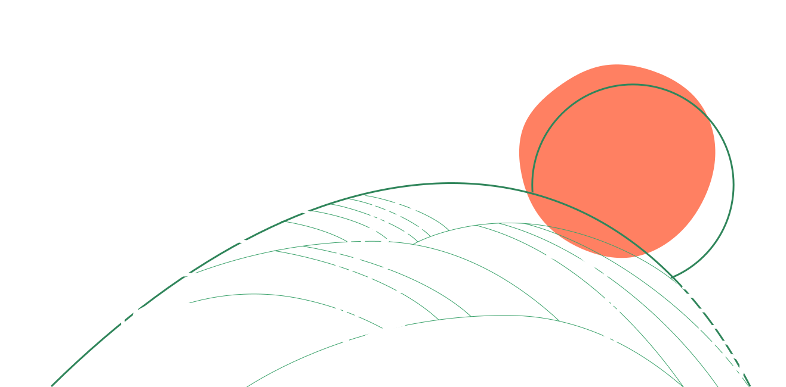

# [Escapista.app](http://escapista.app/) is an webapp for watching great Slow TV and ambient videos with a TV-like experience: chose your channel, lean-back and relax.

<!--  -->

## History & motivation 

Since the beginning of the COVID pandemic, I started gathering YouTube Channels specialized in this content and I was impressed with how there was so much more than I ever thought!

So along with a friend, we started sketching ideas for a website/webapp to showcase all the great videos we found - for free, of course. We'd like to help popularize Slow TV, as well as help all the quarantined people around the world so they feel better about being stuck at home.

## Contribute with ideas

We're still on a discovery phase, so it's soon for accepting code contributions.

But we'd love to have your ideas. We've created this quick survey to gather ideas from you about what would make a great app. It takes approximately 10 minutes, but your contribution here will help us so much.

https://forms.gle/zy8tnjebV6c8Hiwm8

Thank you for helping make Slow TV even more popular and accessible.